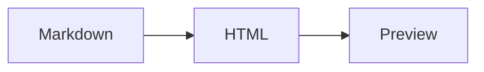

# Code Block Rendering Sample

This file exercises Shiki syntax highlighting for common fenced code blocks.
Mermaid blocks should still render as diagrams instead of highlighted code.

```swift
import Foundation

struct Release: Decodable {
    let version: String
    let publishedAt: Date
}

func newestRelease(from data: Data) throws -> Release {
    let decoder = JSONDecoder()
    decoder.dateDecodingStrategy = .iso8601
    return try decoder.decode(Release.self, from: data)
}
```

```javascript
const buttons = document.querySelectorAll('[data-action]')

for (const button of buttons) {
  button.addEventListener('click', () => {
    console.log(`Running ${button.dataset.action}`)
  })
}
```

```json
{
  "bundleId": "com.imira.reader",
  "productName": "iMira",
  "features": ["math", "mermaid", "shiki"]
}
```

```bash
swift build
```


